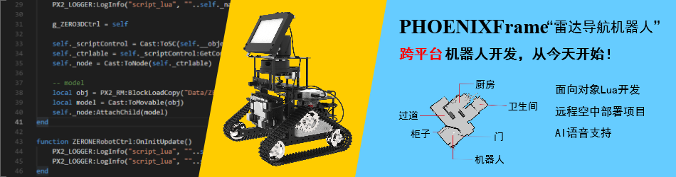

# PHOENIXEngine

开源，跨平台，室内机器人及物联网开发引擎

open soruce cross platform system for robots/iOT

# 交流社区

GitHub地址：https://github.com/manykits/PHOENIXEngine

Gitee地址：https://gitee.com/manykit/PHOENIXEngine

工具集网盘地址：https://pan.baidu.com/s/1kOyEf1ae9liBbLZNYQ-Y2Q#list/path=%2F

QQ交流群：336273110

网址website: www.manykit.com

商城market: https://shop194048616.taobao.com

入门小车：https://v.qq.com/x/page/o074128or8x.html

SLAM小车：

https://www.bilibili.com/video/av34671485

https://www.bilibili.com/video/av36472703

https://item.taobao.com/item.htm?spm=a1z10.1-c-s.w4004-18124103205.16.3446620cR5ddAt&id=583251201215

“引擎在不断更新演化，相信美好的事情将发生:-D”

# 版本

版本：测试版 0.01

主要核心功能：

    功能完备的3D场景仿真渲染，UI组件等

    基于Windows和Liunx室内机器人自主定位建图，路径规划0.01版
    
快速编译测试：

    在Windows平台，下载安装VisualStudio2015，下载引擎及依赖库解压，编译即可运行

## 关于PHOENIXEngine

	欢迎来到PHOENIXEngine，这是一个可以用来开发游戏，机器人，物联网项目的开发引擎。集成了HectorSlam，用来做为机器人室内导航。
	引擎已经支持Windows上，ARM，Linux，LinuxARM，iOS平台，使用简洁高效的Lua作为主要逻辑开发，使用C++/C作为底层构建语言。
	通过跨平台编译，可以将项目运行在所需要的平台上。
	借助Arduino，ESP8266/32等芯片，使用PHOENIXFrameWireWall，引擎可以支持一般的物联设备开发。
	当需要更高级的嵌入式方案时，我们可以选择LinuxArm作为开发环境，打造高级的物联网系统。
	PHOENIXEngine只选择了最基本的两种语言C/C++和Lua，降低使用者的门槛。引擎致力于打造容易实用，典雅优美的开发体验。
	
## 关于PHOENIXFrame

    PHOENIXFrame是一个基于通用开源硬件形成的机器人开发硬件，和PHOENIXEngine配合，是软件工程师学习机器人非常好的平台工具。
    PHOENIXFrame包含普通版本和SLAM两个版本：
    基础版: 铝合金骨架，金属连接件装饰件，ZODuino，传感器，电池，手机支架，机械臂，铜柱，螺丝螺母，工具等
    高级版: 包含基础版所有内容，同时包含树莓派Raspberry，树莓派扩展板，多功能充电电池，摄像头，激光雷达，树莓派屏幕，相关配件等
	
## 关于作者
    
    引擎一直由ManyXu在维护，ManyXu从腾讯IEG，思前想后，多番权衡，辞职后，孤身来到了深圳华强北，开了一家小公司-深圳许多米科技，
    从事跨平台机器人软硬件的开发。今天将其开源出来，终于开始小规模测试。

## 版权信息/Licence

	ManyKit开源协议：
	PHOENIXEngine是一个开源开放的引擎，拥有免费版本和商业版本，开源版本只需要遵循较少的规则就可以免费用于商业开发，商业版本包含相关的技术服务。协议声明如下：
	1.任何人，组织都可以自由修改引擎，免费应用于商业开发。
	2.使用PHOENIXEngine免费版本，必须在醒目位置标注PHOENIXEngine的商标，并且在软件中出现PHOENIXEngine开源协议，即本协议。
	3.用户开发的扩展包，可以选择开源或者闭源，对自己开发的开发包享有完全的自主控制权利。
	4.许多米科技保留对PHONEIXEngine，PHOENIXFrame的商标权。
	5.许多米科技目前保留对引擎的教育培训领域的完全使用权，第三方如想要使用PHOENIXEngine作为培训教育，许多米可以进行相关培训，获得相关认证。
	6.许多米科技目前保留对引擎技术社区，包含项目交流社区的独家开发使用权。
	7.任何捐赠第三方必须首先提出对引擎修改意见和技术支持的具体需求。

##  编译/Compile

### 依赖库

ThirdPartiesLibs.zip：[https://pan.baidu.com/s/1kOyEf1ae9liBbLZNYQ-Y2Q](https://pan.baidu.com/s/1kOyEf1ae9liBbLZNYQ-Y2Q)

依赖库在MANYKIT/PHOENIX/下

下载放置PHOENIXEngine\Phoenix目录下，解压。

如需编译编辑器NIRVANA2，预先编译ThirdPartiesLibs/wxWidgets-3.1.1/build/msw/wx_vc14.sln

### Windows

首先确认安装了依赖库（上一步骤）

使用visualstudio打开PHOENIXEngine/PHOENIX.sln编译

### Linux

当前目录为PHOENIXEngine/PHOENIX

**1.配置**
	
	sudo sh ./linuxbuildconfig.sh

**2.编译引擎库libPX2Engine.so(注意这里不需要sudo):**

	sh ./linuxbuild.sh

**3.安装引擎库:**

	sudo sh ./linuxbuildinstall.sh

**4.如果具体的项目是动态链接库，需要编译c++源文件，例如项目名称为Sample编译项目库为Sample.so
如果想要运行引擎，进行快速查看，可以不需要编译，跳过此项

	在目录PHOENIXEngine/PHOENIX/Projects/Client/Sample中执行:make CFG=ReleaseDynamic -f makefile.px2
	
**4.1如果具体的插件是动态链接库，需要编译c++源文件，例如插件名称为Slam2D编译项目库为Slam2D.so（ 新版Slam2D已经移动到引擎本体，所以开发Slam机器人不再需要单独编译Slam2D插件）

	在目录PHOENIXEngine/PHOENIX/Plugins/Slam2D中执行:make CFG=ReleaseDynamic -f makefile.px2

**5.运行最终的可执行程序**
	
	在PHOENIXEngine/PHOENIX/Bin目录执行 ./AppPlayer.ReleaseDynamic
	
### Linux Raspberry

**1.配置**
	
	sudo sh ./linuxbuildconfigarm.sh

**2.编译引擎库libPX2Engine.so(注意这里不需要sudo):**

	sh ./linuxbuildarm.sh

**3.安装引擎库:**

	sudo sh ./linuxbuildinstallarm.sh

**4.如果具体的项目是动态链接库，需要编译c++源文件，例如如果项目名称为Sample编译项目库为Sample.so
如果想要运行引擎，进行快速查看，可以不需要编译，跳过此项

	在目录PHOENIXEngine/PHOENIX/Projects/Client/Sample中执行:make CFG=ReleaseARMDynamic -f makefile.px2
	
**4.1如果具体的插件是动态链接库，需要编译c++源文件，例如插件名称为Slam2D编译项目库为Slam2D.so（ 新版Slam2D已经移动到引擎本体，所以开发Slam机器人不再需要单独编译Slam2D插件）

	在目录PHOENIXEngine/PHOENIX/Plugins/Slam2D中执行:make CFG=ReleaseARMDynamic -f makefile.px2

**5.执行**
	
	在PHEONIXEngine/PHOENIX/Bin目录执行 AppPlayer.ReleaseARMDynamic
	
	树莓派图形处理能力很弱，可以直接执行 AppPlayer.ReleaseARMDynamic window=0 运行命令行程序

### Android

目前我们使用的还是旧的Android编译方法，使用Crygwin进行编译。

	下载Cygwin:
	安装Cygwin:
	使用Cygwin进行编译:
	使用Ecplise打开项目进行发布:
	导出Ecplise Android项目:

### IOS

	使用XCode打开项目PHOENIX/Phoenix.xcworkspace编译项目

## 使用方法/General Use

- Bin/Data/Sample 是一个空项目

	Data下的boost.xml决定从哪个项目启动
	boost.lua可以对启动项二次修改
	
	项目运行前，执行，Sample/lua/start.lua中的prestart
	紧接着运行，执行，Sample/lua/start.lua中的start
	用户的项目逻辑在presstart和start函数中写就可以
	
## 更多内容请查看 GitHub Wiki

https://github.com/manykits/PHOENIXEngine/wiki
